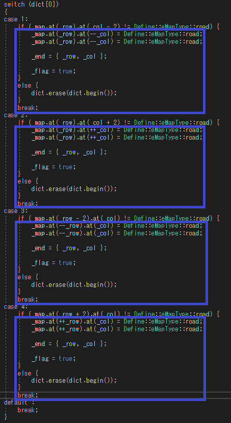

# Maze_Search_Algorithmのリファクタリング
Maze_Search_Algorithmのソースコードをリファクタリングしたプログラムです．
もとのコードは[こちら](https://github.com/alain0077/study_c/tree/master/c%2B%2B/Maze_Search_Algorithm)

## リファクタリングの参考にしたサイト

https://refactoring.com/catalog/

http://objectclub.jp/technicaldoc/refactoring/refact-what


## 行ったリファクタリングについて

### 問題点１
Main関数がマップの生成と各探索手法を行うクラスの呼び出し・管理をしていたため，読みにくくなっていた．
また，迷路探索を行うときに同じWhile文が手法の数だけ出来てしまうような，コードクローンが見られたためこの改善を行いました．
下の図の青で囲っている部分がコードクローンです．


#### 改善方法
改善方法としてクラスの追加を行いました．
それに伴い，設計の変更をしました．
この改善により，手法の実行はLooperクラスが一括管理しているため，
新たな探索手法の追加の容易性が見込める．
また，迷路の生成などもMapクラスが一括で管理するため，迷路の生成手法を追加するときのコードの複雑化を低減できると考えています．

#### 追加したクラス
##### Looperクラス
各手法を呼び出し管理する．このクラスをMain関数にてWhile文で回すだけで，すべての手法の実行が出来る形にしました．

##### Mapクラス
このクラスが迷路を管理するようにしました．
ランダム作成，スタート座標とゴール座標の保持をします．

##### 追加したクラスについて


##### 変更前のクラス図


##### 変更後のクラス図


### 問題点２
Swicth文は，コードの複雑化の要因になり易い？らしい… 今回はSwicth文を使うことによって出来ているコードクローンを修正してみました．下の図の青で囲っている部分がそのコードクローンです．



このコードが書かれていたのは，ランダムな迷路を生成するための部分です．問題点１の改善として，新たに作ったMapクラスのメンバ関数CreatMap() 内の処理です．

#### 改善方法
この文のやっていることとしては，ある方向に対して，掘り進めれるかの判定と掘り進める処理を行っています．なので，その方向を探索するための差分の値を配列にまとめ，dict[0]の値に応じた適切な差分を与えるようにする．改善したコードを以下に貼ります．

``` dif_c++
vector<pair<int, int>> d = { {0, -1}, {0, 1}, {-1, 0}, {1, 0} };

pair<int, int> offset = d[dict[0]];

if (_map.at(_row + offset.first * 2).at(_col + offset.second * 2) != Define::eMapType::road) {
    _map.at(_row + offset.first).at(_col + offset.second) = Define::eMapType::road;

    _row += offset.first * 2;
    _col += offset.second * 2;

    _map.at(_row).at(_col) = Define::eMapType::road;

    _end = { _row, _col };

    _flag = true;
}
else {
    dict.erase(dict.begin());
}
```

この改善により，4つのIF文から1つにまとまりました．