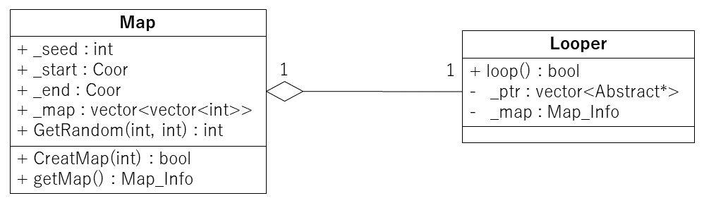

# Maze_Search_Algorithmのリファクタリング
Maze_Search_Algorithmのソースコードをリファクタリングしたプログラムです．

## リファクタリングの参考にしたサイト

https://refactoring.com/catalog/

http://objectclub.jp/technicaldoc/refactoring/refact-what

## 行ったリファクタリングについて

### 問題点1
Main関数がマップの生成と各探索手法を行うクラスの呼び出し・管理をしていたため，読みにくくなっていた．
また，迷路探索を行うときに同じWhile文が手法の数だけ出来てしまうような，コードクローンが見られたためこの改善を行いました．
青で囲っている部分がコードクローンです．

### 改善方法
改善方法としてクラスの追加を行いました．
それに伴い，設計の変更をしました．

### 追加したクラス
#### Looperクラス：
各手法を呼び出し管理する．このクラスをWhile文で回すだけで，すべての手法の実行が出来る形にしました．

#### Mapクラス：
このクラスが迷路を管理するようにしました．
ランダム作成，スタート座標とゴール座標の保持をします．

#### 追加したクラスについて

#### 変更前のクラス図

#### 変更後のクラス図

